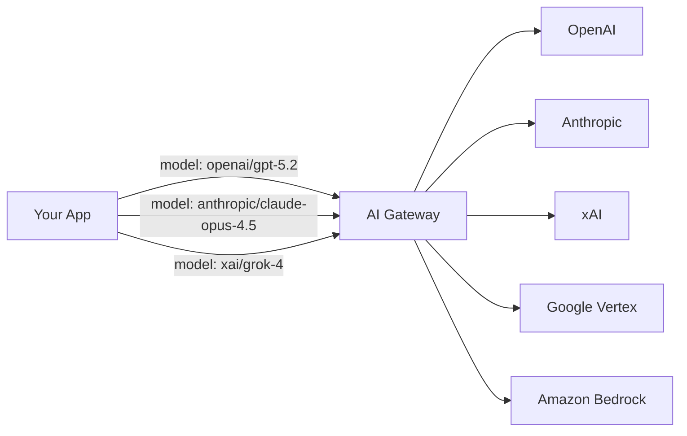
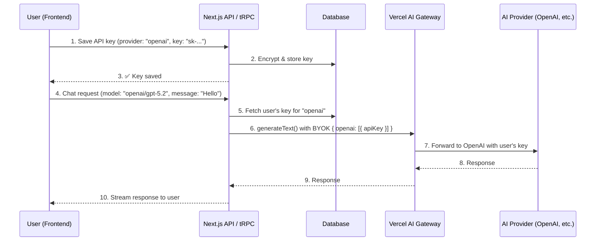

# AI Gateway Brainstorm — Multi-Provider Model App

## What is the Vercel AI Gateway?

The **AI Gateway** is a **unified proxy endpoint** (`https://ai-gateway.vercel.sh/v1`) that sits between your app and dozens of AI providers (OpenAI, Anthropic, Google, xAI, Amazon Bedrock, etc.). Instead of integrating each provider's SDK separately, you hit **one endpoint** with a model string like `openai/gpt-5.2` or `anthropic/claude-sonnet-4.5`, and the gateway routes the request to the correct provider.



### How it works under the hood

1. **Single API key** — You authenticate to the Gateway with one `AI_GATEWAY_API_KEY` (created in Vercel Dashboard)
2. **Model string routing** — The format `provider/model-name` tells the gateway which downstream provider to hit
3. **OpenAI-compatible API** — The gateway exposes `/v1/chat/completions`, `/v1/embeddings`, etc., so any OpenAI-compatible client can use it
4. **BYOK (Bring Your Own Key)** — You can pass the user's own provider API keys **per-request** via `providerOptions.gateway.byok`, so the gateway uses their key instead of yours
5. **Fallbacks & retries** — If a provider fails, the gateway can retry with another provider or fall back to system credentials
6. **Dynamic model discovery** — `GET /v1/models` returns all available models with pricing, context windows, etc. — no auth required

### Key benefit for our use case

> **Request-scoped BYOK** lets us pass each user's API key on a per-request basis. The user's key never needs to be stored in Vercel — we store it in our own database and inject it into each AI SDK call.

---

## The App Concept

An app where:
1. **User picks a provider** (OpenAI, Anthropic, Google, xAI, etc.)
2. **User provides their API key** for that provider
3. **We store the key** securely in our backend (encrypted in our DB)
4. **User can then chat/interact** with any model from that provider, with their key being used per-request via the AI Gateway's BYOK mechanism

---

## Architecture Plan

### High-Level Flow



---

### Component Breakdown

#### 1. Database — `ai_provider_keys` table

| Column | Type | Description |
|---|---|---|
| `id` | `uuid` | Primary key |
| `user_id` | `uuid` | FK → `user.id` |
| `provider` | `text` | e.g. `"openai"`, `"anthropic"`, `"google"` |
| `encrypted_key` | `text` | AES-256-GCM encrypted API key |
| `iv` | `text` | Initialization vector for decryption |
| `label` | `text` | Optional user-friendly name |
| `is_active` | `boolean` | Whether this key is currently active |
| `created_at` | `timestamp` | When the key was added |
| `updated_at` | `timestamp` | Last update |

> [!IMPORTANT]
> API keys must be encrypted at rest using a server-side encryption key (`ENCRYPTION_SECRET` env var). Never store raw keys.

#### 2. Backend — tRPC Routers

##### `aiKeys` router (CRUD for API keys)

| Procedure | Type | Description |
|---|---|---|
| `addKey` | `mutation` | Encrypt + store a provider API key |
| `listKeys` | `query` | List user's configured providers (masks actual keys) |
| `deleteKey` | `mutation` | Remove a provider key |
| `testKey` | `mutation` | Validate a key by making a small test request |

##### `aiChat` router (Chat / model interaction)

| Procedure | Type | Description |
|---|---|---|
| `getModels` | `query` | Fetch available models from `GET /v1/models`, filtered by provider |
| `chat` | `mutation` | Send message, fetch user's key from DB, call AI SDK with BYOK |
| `streamChat` | `subscription` | Same as chat but streamed via SSE/subscription |

#### 3. Frontend — Pages & Components

##### Provider Settings Page (`/settings/ai`)

- List of supported providers (OpenAI, Anthropic, Google, xAI)
- For each: input field for API key, "Test" button, "Save" button
- Show active/inactive status per provider
- Mask stored keys (show `sk-...xxxx`)

##### Chat Page (`/chat`)

- Model selector dropdown (populated from available models)
- Filter by provider (only show models from providers where user has a key)
- Chat interface with streaming responses
- Model info badge (shows pricing, context window)

##### Model Discovery (`/models`)

- Browse all available models from `GET /v1/models`
- Filter/search by provider, type, pricing
- Show which models the user can access (has key for that provider)

---

### Key Code Patterns

#### Storing a key (backend)

```typescript
// Encrypt before storing
import { createCipheriv, createDecipheriv, randomBytes } from 'crypto';

function encryptKey(apiKey: string): { encrypted: string; iv: string } {
  const iv = randomBytes(16);
  const cipher = createCipheriv('aes-256-gcm', process.env.ENCRYPTION_SECRET!, iv);
  const encrypted = cipher.update(apiKey, 'utf8', 'hex') + cipher.final('hex');
  const authTag = cipher.getAuthTag().toString('hex');
  return { encrypted: encrypted + ':' + authTag, iv: iv.toString('hex') };
}
```

#### Using a key with AI Gateway BYOK (backend)

```typescript
import { generateText } from 'ai';
import type { GatewayProviderOptions } from '@ai-sdk/gateway';

// Fetch user's decrypted key from DB
const userKey = await decryptKey(dbRecord.encrypted_key, dbRecord.iv);

const { text } = await generateText({
  model: 'openai/gpt-5.2',
  prompt: userMessage,
  providerOptions: {
    gateway: {
      byok: {
        openai: [{ apiKey: userKey }],   // <-- user's own key!
      },
    } satisfies GatewayProviderOptions,
  },
});
```

#### Fetching available models (dynamic discovery)

```typescript
const response = await fetch('https://ai-gateway.vercel.sh/v1/models');
const { data: models } = await response.json();

// Filter to only providers the user has keys for
const userProviders = ['openai', 'anthropic']; // from DB
const availableModels = models.filter((m) =>
  userProviders.some((p) => m.id.startsWith(p + '/'))
);
```

---

### Credential Structure Per Provider

| Provider | Key Shape |
|---|---|
| **OpenAI** | `{ apiKey: string }` |
| **Anthropic** | `{ apiKey: string }` |
| **Google Vertex AI** | `{ project: string, location: string, googleCredentials: { privateKey: string, clientEmail: string } }` |
| **Amazon Bedrock** | `{ accessKeyId: string, secretAccessKey: string, region?: string }` |
| **xAI** | `{ apiKey: string }` |

> [!NOTE]
> Most providers just need an `apiKey`. Google Vertex and Amazon Bedrock require richer credentials with project/region info.

---

### Required Dependencies

| Package | Purpose |
|---|---|
| `ai` | Vercel AI SDK core (`generateText`, `streamText`) |
| `@ai-sdk/gateway` | Gateway provider + BYOK types |
| `crypto` (Node built-in) | Key encryption/decryption |

---

## Security Considerations

1. **Encryption at rest** — All API keys encrypted with AES-256-GCM before DB storage
2. **Never expose keys to frontend** — Keys are decrypted only server-side, only at the moment of the AI call
3. **Key masking** — When listing keys, only show last 4 characters
4. **Auth-gated** — All key management and chat endpoints require authenticated user session (Better Auth)
5. **Rate limiting** — Limit chat requests per user to prevent abuse
6. **Audit logging** — Log when keys are added/removed/used (without logging the key itself)

---

## Implementation Phases

### Phase 1 — Foundation
- [ ] Add `ai_provider_keys` schema to Drizzle
- [ ] Implement encryption utilities (`encrypt`/`decrypt` functions)
- [ ] Create `aiKeys` tRPC router (add, list, delete, test)

### Phase 2 — Chat Integration
- [ ] Implement `aiChat` tRPC router with BYOK
- [ ] Add model discovery endpoint (fetch from `/v1/models`)
- [ ] Implement streaming chat with `streamText`

### Phase 3 — Frontend
- [ ] Provider settings page with key management UI
- [ ] Model selector component
- [ ] Chat interface with streaming

### Phase 4 — Polish
- [ ] Rate limiting
- [ ] Usage tracking / audit logs
- [ ] Provider health indicators
- [ ] Model comparison view

---

## Open Questions

1. **Do we also need a Vercel AI Gateway API key?** — Yes, even with BYOK, you still need a `AI_GATEWAY_API_KEY` to authenticate with the gateway itself. The user's key is sent alongside via `providerOptions`.
2. **Alternative: Direct provider calls?** — We *could* skip the gateway and call providers directly using their individual SDKs (`@ai-sdk/openai`, `@ai-sdk/anthropic`, etc.). Trade-off: more code per provider, but no dependency on Vercel infrastructure.
3. **Should we support multiple keys per provider?** — Useful for teams or cost distribution. The BYOK mechanism supports arrays of credentials per provider.
