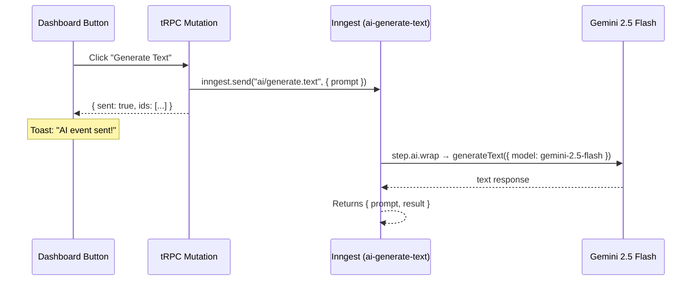

# Done — Inngest + AI SDK `generateText` Test

Implemented on: 2026-02-12

---

## What was done

Wired up a complete flow: **Dashboard Button → tRPC Mutation → Inngest Event → Gemini `generateText`**

### Files created / modified

| File | Action | What it does |
|---|---|---|
| [index.ts](file:///Users/ashutoshhota/Coding/play_ground/ai_apps/autonode/src/services/ai/index.ts) | Modified | `generateWithGemini()` — wraps AI SDK `generateText` with `@ai-sdk/google` using `gemini-2.5-flash` |
| [generate-text.ts](file:///Users/ashutoshhota/Coding/play_ground/ai_apps/autonode/src/inngest/functions/generate-text.ts) | Created | Inngest function `ai-generate-text` — listens for `ai/generate.text` events, calls Gemini via `step.ai.wrap()` with `retries: 2` |
| [functions.ts](file:///Users/ashutoshhota/Coding/play_ground/ai_apps/autonode/src/inngest/functions.ts) | Modified | Re-exports `aiGenerateText` from the new file |
| [route.ts](file:///Users/ashutoshhota/Coding/play_ground/ai_apps/autonode/src/app/api/inngest/route.ts) | Modified | Registered `aiGenerateText` in the Inngest `serve()` call |
| [workflows.ts](file:///Users/ashutoshhota/Coding/play_ground/ai_apps/autonode/src/server/api/routers/workflows.ts) | Modified | Added `generateText` tRPC mutation — sends `ai/generate.text` event with a hardcoded test prompt |
| [dashboard.sections.tsx](file:///Users/ashutoshhota/Coding/play_ground/ai_apps/autonode/src/components/dashboard/dashboard.sections.tsx) | Modified | Added "Test AI" / "Generate Text" button wired to the tRPC mutation with toast feedback |
| `.env` | Modified | Added `GOOGLE_GENERATIVE_AI_API_KEY` |

### Dependencies added

| Package | Version | Purpose |
|---|---|---|
| `@ai-sdk/google` | `^3.0.26` | Google Gemini provider for AI SDK |

---

## How it works

---

## How to test

1. Set `GOOGLE_GENERATIVE_AI_API_KEY` in `.env`
2. Start dev server: `pnpm dev:all` (runs Next.js + Inngest Dev Server via `mprocs`)
3. Open dashboard → click **"Generate Text"** button
4. Check Inngest Dev Server at `http://localhost:8288` for the function run and its output

---

## Verified output

> "Inngest is a serverless event-driven framework that enables developers to turn regular functions into durable, reliable background jobs and stateful workflows. It automatically handles event ingestion, retries, state management, and long-running process orchestration for complex application logic without bespoke infrastructure."

---

## Issue encountered & resolved

Initially used `gemini-2.0-flash` which had zero free tier quota (`limit: 0`) after being superseded. Also used `step.run()` for the AI call.

**Fixes:**
- Model upgraded to `gemini-2.5-flash` (current default, GA June 2025)
- Switched to `step.ai.wrap()` for AI-specific observability
- Added `retries: 2` to avoid burning retries on non-transient errors

Full RCA: [gemini-quota-exceeded-rca.md](file:///Users/ashutoshhota/Coding/play_ground/ai_apps/autonode/docs/errors/gemini-quota-exceeded-rca.md)

---

## Hardcoded test prompt

> "Explain what Inngest is in 2 sentences. Keep it concise and technical."

This can be changed later when we build a proper prompt input.
